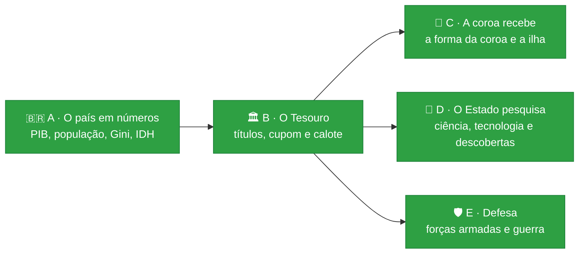

# 🎲 Trajetória

[](https://github.com/Lhordriyon/Calculadora-Viva/actions/workflows/ci.yml)
[](https://github.com/Lhordriyon/Calculadora-Viva/actions/workflows/android.yml)


## 📱 [Baixar o app para Android (APK)](https://github.com/Lhordriyon/Calculadora-Viva/releases/download/android/Trajetoria.apk)

## 🌐 [Jogar no navegador](https://lhordriyon.github.io/Calculadora-Viva/)

**Instalar no Android:** toque no link acima pelo celular, abra o arquivo `Trajetoria.apk` quando o download terminar e confirme. Se o Android pedir, permita que o navegador instale apps ("fontes desconhecidas"). Para atualizar, baixe de novo e instale por cima: a vida salva continua. O APK é gerado de novo a cada atualização do jogo ([página da versão](https://github.com/Lhordriyon/Calculadora-Viva/releases/tag/android)).

---

## 🆕 Novidades: S2 · O segundo ato (04/11/2026)

> [!IMPORTANT]
> **O que mudou:** o sonho não acaba numa linha. Ele tem o dia em que chega, e a vida continua depois dele.
> - **O dia do sonho.** Quando o sonho se realiza, o mesmo ano traz a cena do topo, com três jeitos de viver o momento. No estádio cheio: a primeira música que você aprendeu, a turnê pelo mundo ou quem duvidou chamado ao palco. Nos cem milhões: o bônus para todo mundo, a festa para a cidade ou segunda-feira às oito. Na posse: o discurso da escola pública, a promessa grande demais (que alguém cobra no ano seguinte) ou a família no parlatório. E a foto da família inteira, e as bodas de prata.
> - **E agora?** Um ano depois do sonho realizado, a vida pergunta o que vem depois. Se o sonho não veio, ela lembra do que ficou e pergunta o que fazer com o espaço.
> - **Sonhos da segunda metade.** A fortuna (R$ 50 milhões), o lugar no mundo (o sítio, a casa de praia ou a fazenda), a volta ao mundo e ver os netos crescerem, cada um com cenas próprias. E quem chega aos 50 sem sonho de pé ouve a pergunta: o que você quer da segunda metade?
> - **O cartão conta os dois atos**, e o dia do sonho entra na linha do sonho realizado.

> [!TIP]
> **Para testar:**
> - Realize um sonho (a casa cheia e o amor para a vida toda são os mais alcançáveis) e veja o dia do sonho no mesmo ano.
> - Um ano depois, responda o "e agora?" e acompanhe o sonho novo na folha Planos.
> - Chegue aos 50 sem sonho de pé e responda a pergunta da segunda metade.
> - No fim, leia os dois atos no cartão.

| ✅ O que o bloco trouxe | ⏳ O que ele ainda não trouxe |
|---|---|
| 🌅 O dia do sonho, com escolha, para os cinco sonhos | 🔁 O sonho que não veio passando para quem herda |
| ❓ O "e agora?" e "o sonho que ficou" | 🎲 A sorte grande: uma chance extraordinária por vida |
| 🌍 Quatro sonhos da segunda metade, com cenas | 🕯️ A despedida em várias cenas |
| 🎂 A pergunta dos 50 para quem chega lá sem sonho | 🧑‍🏫 Ensinar o caminho a alguém |

No túnel de vento (10.000 vidas), os anos dos 50 em diante com um sonho de pé foram de 30% para 51,9%. O dia do sonho chegou em 98,4% dos sonhos realizados, e 87,6% dos sonhos que acabaram chegaram à pergunta do que vem depois. Os sonhos da segunda metade são mais alcançáveis que os da juventude: o lugar no mundo se realizou em 912 vidas, a volta ao mundo em 445, os netos em 149 e a fortuna em 110; no total, 19,5% dos sonhos que acabaram se realizaram (eram 11,3%). O dinheiro fechou nas 4,10 milhões de entradas, nenhuma estratégia domina e nenhuma história ficou de fora. A variedade ficou praticamente onde estava (saturação de 53,1% na 5ª vida e de 87,2% na 20ª, eram 52,6% e 87,0%, porque as duas perguntas aparecem em quase toda vida), com 903 histórias por 1.000 vidas. Os toques ficaram em 478,9 por vida (eram 479,2). A oferta hostil na bolsa continua abaixo do portão: 0,07% das vidas (era 0,09%). Os blocos anteriores estão no [`CHANGELOG.md`](CHANGELOG.md).

## 🗺️ Os blocos do dono

Pedidos do dono em 19/10, em blocos pequenos, na ordem em que um precisa do outro. A cara nova (V1) e a correção dela (C1 a C3) entraram no meio, a pedido dele. Os cinco estão feitos; seguem o bloco B2 (o título comprado pela empresa e o orçamento do governo item por item) e a identidade das pessoas (o ex que continua existindo):


```mermaid
flowchart LR
  A["🇧🇷 A · O país em números<br/>PIB, população, Gini, IDH"]:::feito --> B["🏛️ B · O Tesouro<br/>títulos, cupom e calote"]:::feito
  B --> C["👑 C · A coroa recebe<br/>a forma da coroa e a ilha"]:::feito
  B --> D["🔬 D · O Estado pesquisa<br/>ciência, tecnologia e descobertas"]:::feito
  B --> E["🛡️ E · Defesa<br/>forças armadas e guerra"]:::feito
  classDef feito fill:#2ea043,stroke:#1a7f37,color:#fff
  classDef proximo fill:#bf8700,stroke:#9a6700,color:#fff
  classDef depois fill:#8250df,stroke:#6639ba,color:#fff
```

| Bloco | O que entra | Por que nesta ordem |
|---|---|---|
| 🟢 **A** · O país em números | PIB, população, PIB per capita, Gini, IDH | ✅ feito |
| 🟢 **B** · O Tesouro | o título do Tesouro com cupom, vencimento e calote; a dívida pública em reais | ✅ feito (o título da empresa espera o caixa dela, I-11) |
| 🟢 **C** · A coroa recebe | o salário, a parte dos impostos ou a taxa da coroa; a ilha com população, PIB e imposto | ✅ feito |
| 🟢 **D** · O Estado pesquisa | a ciência paga pelo Tesouro, a tecnologia do país e as descobertas (a cura, o satélite, a patente) | ✅ feito |
| 🟢 **E** · Defesa | forças armadas com custo e capacidade; os sistemas de armamento; a guerra como processo, com custos e consequências | ✅ feito (a ocupação e as alianças militares ficam para depois) |

### A segunda lista do dono (26/10)

A lista nova não cabe de uma vez. A ordem começa pelos defeitos (o que já existe e não funciona) e segue pelo que mais muda o que dá para fazer numa vida, um bloco publicado de cada vez. As ideias de cada um estão em [`docs/ideias.md`](docs/ideias.md) (a seção "A segunda ordem do dono").


```mermaid
flowchart LR
  F["👑 F · O poder que passa<br/>sucessão, golpe, governo vitalício"]:::feito --> F2["🏝️ F2 · Governar o que você fundou<br/>a ilha e a cidade"]:::proximo
  F2 --> C4["✍️ C4 · O texto revisado"]:::depois
  C4 --> K["👶 K · Filhos quando quiser"]:::depois
  K --> I["💰 I · O dinheiro que rende"]:::depois
  I --> H["🏭 H · A empresa de verdade"]:::feito
  H --> J["🧬 J · A vida longa"]:::depois
  classDef feito fill:#2ea043,stroke:#1a7f37,color:#fff
  classDef proximo fill:#bf8700,stroke:#9a6700,color:#fff
  classDef depois fill:#8250df,stroke:#6639ba,color:#fff
```

| Bloco | O que entra | Estado |
|---|---|---|
| 🟢 **F** · O poder que passa | a sucessão da coroa, do Regime e da ilha para quem herda (com a regência); o golpe, o autogolpe e a coroa restaurada; quem vai reinar na ilha deixa o Brasil; o resgate do país como título | ✅ feito |
| 🟡 **F2** · Governar o que você fundou | a ilha e a cidade como territórios, com imposto e obras pagas do próprio bolso | ⏭️ próximo |
| 🟣 **C4** · O texto revisado | a varredura de gramática do conteúdo inteiro, com regras novas no validador | depois |
| 🟣 **K** · Filhos quando quiser | tentar ter filho, adotar e planejar, com a fertilidade pela idade | depois |
| 🟣 **I** · O dinheiro que rende | os bens que produzem, a carteira de dívidas do SPC e do Serasa como ativo, o empréstimo aos bancos como contrato | depois |
| 🟢 **H** · A empresa de verdade | o caixa da empresa, o lucro com origem, a pesquisa e desenvolvimento, as fábricas e lojas | ✅ feito (01/11, antes do F2, a seu pedido): o caixa, o produto, o mercado e a quebra por causa |
| 🟣 **J** · A vida longa | a ciência da longevidade, com etapas até a reversão do envelhecimento e a continuidade do eu | depois |
| 🟣 **G**, **L**, **M**, **P**, **N** | os impostos um por um; a escola inteira e mais profissões; a civilização; os gráficos; as formas de governo | depois |
| ⚪ **O** · O mundo | o mapa-múndi e os países de verdade | pede a sua decisão: hoje governos, partidos e países são fictícios por requisito seu |

## 🎮 O que o jogo tem

<details open>
<summary><b>👶 A vida</b></summary>

- Nascer numa cidade brasileira, em 8 classes sociais (do barraco ao trilionário), 4 tipos de família e 9 linhagens (família real, Regime, futebol, circo, agro, políticos…), ou criar o personagem escolhendo tudo
- Primeira infância com causa e efeito: o que acontece até os 4 anos volta dos 5 aos 12
- ENEM, curso, 49 profissões com cargos e promoção, concurso, aposentadoria
- Família viva: mãe, pai, avó, amor e até quatro filhos, cada um com saúde, dinheiro, jeito e vínculo, que envelhecem, adoecem, ajudam ou atrapalham
- Gente com identidade: os irmãos, o ex que pode voltar, o colega e o chefe que vêm com o emprego, os amigos de infância e os da vida adulta; cada pessoa lembra do que você fez e tem opinião sobre você
- A pessoa decide: quem responde a um pedido pesa o que viveu com você e diz por quê; o empréstimo entre pessoas é contrato, com parcela, atraso e calote
- Os planos: a casa própria, sair das dívidas, um filho, o negócio, reparar uma relação, com etapas que são a vida de verdade
- Os sonhos: aos 15, virar estrela, construir um império ou governar o país; no amor, a casa cheia ou um amor para a vida toda; na segunda metade, a fortuna, o lugar no mundo, a volta ao mundo e os netos; cada um com cenas próprias, o dia em que chega e o "e agora?" depois
- Os segredos: o caso, a dívida escondida, a festa que era estudo, o esquema no trabalho; a fofoca que corre, a chantagem e a revelação
- Fichas de ação por ano: estudar, trabalhar, cuidar da saúde, ver a família, sair, poupar
</details>

<details>
<summary><b>💸 O dinheiro</b></summary>

- Carteira em cinco classes (renda fixa, ações, fundos imobiliários, dólar, cripto), três perfis de investidor e o padrão de vida escolhido
- Toda dívida é um contrato com o banco: cheque especial, empréstimo, financiamento com garantia e acordo. Atrasar suja o nome, e o imóvel financiado vai a leilão
- Emprestar ao governo: o título do Tesouro paga cupom todo ano, vence ou é vendido pelo preço do dia, e o calote leva parte dele
- 30 bens: morar, alugar, financiar, imóveis de renda, carros, iate, jatinho, emissora de TV
- O dinheiro que existe: as contas do país com saldo, o crédito que cria dinheiro, a emissão do Banco Central e a inflação que vem do dinheiro que sobra
- Até cinco empresas que são negócios: caixa, clientela, estrutura com obra, preço, salário, qualidade, marca, marketing, P&D, exportação e quebra por causa; com subsidiárias, fusões, bolsa e a mesa de quem manda
- Brincar de deus: 14 jogadas bilionárias, de uma estátua a uma colônia em Marte, e a ilha que vira país, com população, PIB e coroa
- Todo real tem contraparte: o extrato do ano e o da vida fecham entrada por entrada
</details>

<details>
<summary><b>🏛️ O país e o mundo</b></summary>

- O país vivo: crescimento, desemprego, inflação, juros, dívida, pobreza, violência, saúde e educação públicas, tecnologia, aprovação, PIB, população, PIB per capita, Gini, IDH e a dívida pública em reais
- A ciência paga pelo Tesouro: a tecnologia do país vira crescimento, saúde e empresas, e descoberta (a cura, o satélite, a patente)
- As Forças Armadas com custo e capacidade, os sistemas de armamento e a guerra como processo: ela começa com quem sanciona e anda frio, custa todo ano e acaba em vitória, derrota ou cessar-fogo
- Quatro blocos políticos fictícios e o Regime; eleições a cada quatro anos; o seu voto pesa
- Ser vereador, prefeito, deputado, governador, senador, presidente, monarca ou chefe do Regime; quem governa muda as políticas do país
- A coroa, o Regime e a ilha passam a quem herda (com a regência até os 18); o poder também se toma: o autogolpe, o golpe e a coroa restaurada no plebiscito
- Quatro países fictícios lá fora, com o dólar, sanções, acordos e atos de quem governa
</details>

<details>
<summary><b>🏰 A dinastia</b></summary>

- Ao morrer, o cartão mostra os três pontos de virada e os capítulos da vida, para compartilhar
- O caminho não tomado: em cada ponto de virada que foi escolha sua, o cartão mostra a vida que você não viveu
- A história continua com quem herda: filho, sobrinho, o par ou um amigo, pelo testamento escolhido em vida
- Sem testamento, os filhos dividem a herança
</details>

## 🚧 O que o jogo ainda não tem

- 🏢 O título do Tesouro comprado pela empresa (o caixa dela já existe), a empresa que pega empréstimo no banco e o orçamento do governo item por item
- ⚖️ A legitimidade de quem governa medida à parte da popularidade
- 🛡️ A ocupação de território, as alianças militares e a guerra entre os países de fora
- 💔 O ex que continua existindo depois do fim do namoro, e as relações entre os personagens (a mãe com o pai, o amigo com o par)
- 💬 Conversar com as pessoas com as suas palavras
- ✈️ Morar em outro país
- 🚔 Crime com consequência
- 🗺️ Setores da economia por estado

Todas as ideias, com o que cada uma precisa antes, estão em [`docs/ideias.md`](docs/ideias.md). A ordem está em [`docs/roteiro.md`](docs/roteiro.md).

---

## 📖 Sobre o jogo

Uma vida inteira em poucos minutos, no celular. Você nasce numa cidade brasileira (ou num palácio, num Brasil onde a monarquia venceu o plebiscito), aperta **+1 ano** e responde ao que a vida joga na sua frente: ENEM, primeiro emprego, cartão de crédito, concurso, Pix suspeito, aposentadoria. A cada ano você escolhe o que fazer, tenta a profissão que quiser, compra imóveis, carros, iate ou uma emissora de TV, abre empresa e compra concorrentes, disputa eleições e escolhe quem herda tudo. Cada escolha deixa uma marca, e algumas voltam décadas depois. Ao morrer, o jogo mostra os três pontos de virada da sua vida num cartão que dá para compartilhar, e a história pode continuar com quem herdou.

## 🛠️ Rodar

Precisa de Node 22.18 ou mais novo.

```sh
npm install
npm run dev        # jogo em http://localhost:5173
npm run verificar  # tipos, testes, validador de conteúdo, túnel de vento e build
```

Outros comandos: `npm run validar` (só o conteúdo), `npm run tunel` (10.000 vidas simuladas → `docs/metricas.md`), `npm run vida -- 42 aleatoria` (imprime uma vida inteira jogada por um robô) e `npm run telas -- URL` (a régua da tela: 52 critérios de interface em sete tamanhos de tela e letra, contra a build no ar).

Para escrever eventos, veja [`docs/conteudo.md`](docs/conteudo.md). O método de trabalho e as regras do projeto estão em [`CLAUDE.md`](CLAUDE.md).
